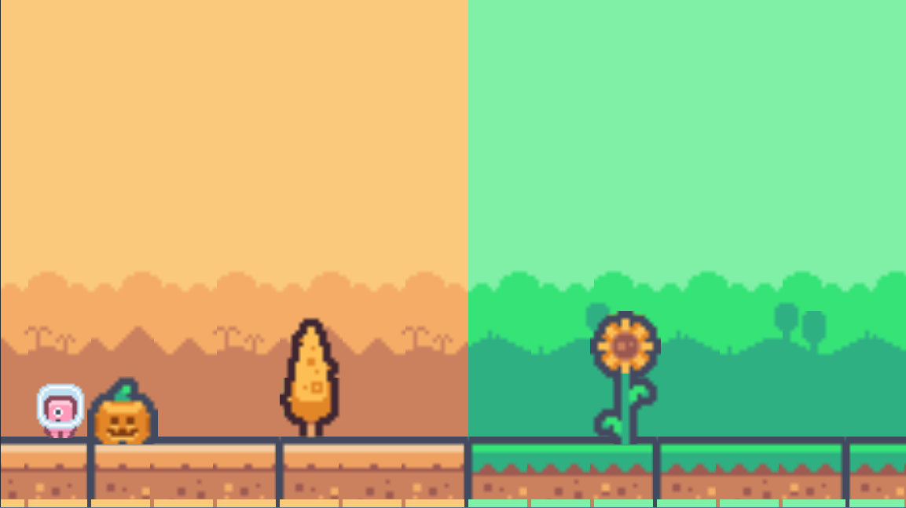

# Too Big Too Season



Small cozy game built at [The Recurse Center](https://www.recurse.com/) using [Godot](https://godotengine.org/) by [Nadia Heredia](https://github.com/nadia-nh), [Brittney Fraser](https://github.com/bnfraser), and [Briana Gude](https://github.com/brianagude), as part of a game jam with the themes of "seasons" and "too big".

Walk through the changing seasons with the character and take in the atmosphere. Try out the game [here](https://forgepixel.itch.io/2-big-2-seasons).

## Running the game locally

Clone the repo:
```bash
git clone https://github.com/nadia-nh/rc-godot-2big2seasons.git
cd rc-godot-2big2seasons
```

Run with Godot 4:

Import the project, and run the main scene with the run project button or by pressing `F5`.

Controls:

- Left and right arrow keys / AD — move
- Up arrow key / W — jump

## Resources

- [Godot Documentation – Creating a 2D Game](https://docs.godotengine.org/en/latest/getting_started/first_2d_game/index.html)  
  Used as a reference for learning core 2D game concepts in Godot.

## Assets

- **Background season images**

  Creator: [Kenney](https://www.kenney.nl/)  
  Source: [Pixel Platformer](https://www.kenney.nl/assets/pixel-platformer)  
  License: CC0

- **Plant images**

  Creator: [Kenney](https://www.kenney.nl/)  
  Source: [Pixel Platformer Farm Expansion](https://www.kenney.nl/assets/pixel-platformer-farm-expansion)  
  License: CC0

- **Snowed tree and snowman images**

  Creator: [Kenney](https://www.kenney.nl/)  
  Source: [Tiny Ski](https://www.kenney.nl/assets/tiny-ski)  
  License: CC0

- **Tree images**

  Creator: [Kenney](https://www.kenney.nl/)  
  Source: [Tiny Town](https://www.kenney.nl/assets/tiny-town)  
  License: CC0

---

Made with <3 at [The Recurse Center](https://recurse.com).  